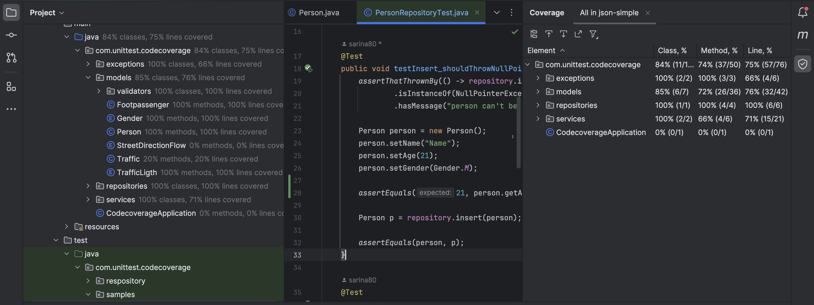

# Experiment 9

## Get Code Coverage Status

### Json-Sample

Here is json-sample project code coverage result:


### CodeCoverageProject

In the pictures below we do the same thing for the second project.


Using the details here, we can improve test  coverage easily:


# Improve Test Coverage

## Repositories Directory

### PersonRepository Class

As we can see in the previous pictures, PersonRepository class test coverage percentage is 0%.

We add 4 methods to test all of this class methods.

#### 1- Insert

Using this code block we test all functionalities of repository.insert() method. If the input person is null, it should throw a NullPointerException. If not, it will return the person.

```java
@Test
    public void testInsert_shouldThrowNullPointerExceptionWhenPersonIsNull() {
        assertThatThrownBy(() -> repository.insert(null))
                .isInstanceOf(NullPointerException.class)
                .hasMessage("person can't be null");

        Person person = new Person();
        person.setName("Name");
        person.setAge(21);
        person.setGender(Gender.M);

        Person p = repository.insert(person);

        assertEquals(person, p);
    }
```

#### 2- Delete

Using this code block we test all functionalities of repository.delete().

```java
@Test
    public void testDelete_shouldThrowNullPointerExceptionWhenStringIsNull() {
        assertThatThrownBy(() -> repository.delete(null))
                .isInstanceOf(NullPointerException.class)
                .hasMessage("name can't be null");

        repository.delete("salam");
    }
```

#### 3- Update

Using this code block we test all functionalities of repository.update().

```java
@Test
    public void testUpdate_shouldThrowNullPointerExceptionWhenPersonIsNull() {
        assertThatThrownBy(() -> repository.update(null))
                .isInstanceOf(NullPointerException.class)
                .hasMessage("person can't be null");

        Person person = new Person();
        person.setName("Name");
        person.setAge(21);
        person.setGender(Gender.M);

        repository.update(person);
    }
```

#### 4- Get

Using this code block we test all functionalities of repository.get().

```java
@Test
    public void testGet_shouldThrowNullPointerExceptionWhenPersonIsNull() {
        assertThatThrownBy(() -> repository.get(null))
                .isInstanceOf(NullPointerException.class)
                .hasMessage("name can't be null");


        repository.get("person");
    }
```

#### Improvement

Using these tests we improved this directory test coverage from 0% to 100%.


## Services Directory

### PersonService Class

As we can see in the previous pictures, PersonRepository class test coverage percentage is 40% of Methods and 33% of Lines.


We add 1 methods to test get method of this class.

#### 1- Get

```java
@Test
    public void testGet() {
        List<String> expectedErrors = Lists.newArrayList("Name is required");
        String expectedMessage = String.join(";", expectedErrors);

        assertThatThrownBy(() -> service.get(null))
                .isInstanceOf(PersonException.class)
                .hasFieldOrPropertyWithValue("errors", expectedErrors)
                .hasMessage(expectedMessage);


        assertNull(service.get("salam"));
    }
```

#### Improvement

After running this test the percentage of this is 60% on Methods and 50% on lines.


## Models Directory

As we can see in the picture below, the previous percentages of classes in this directory is mentioned.


### FootPassenger Class

The previous percentage of this class was 81% on Methods and 81% on Lines.

```java
@Test
    public void testFootpassengerCrossTheStreet() {
        Footpassenger currentFootpassengerBehavior = new Footpassenger();

        currentFootpassengerBehavior.setCrossedTheCrosswalk(true);
        assertTrue(currentFootpassengerBehavior.crossedTheCrosswalk());

        currentFootpassengerBehavior.setCrossedTheCrosswalk(false);
        assertFalse(currentFootpassengerBehavior.crossedTheCrosswalk());
    }
```

After running this test both of the percentages are 100% for this class.


### Person Class

By adding the assertEquals for person.getAge() method we increase percentage of this class.

```java
@Test
    public void testInsert_shouldThrowNullPointerExceptionWhenPersonIsNull() {
        assertThatThrownBy(() -> repository.insert(null))
                .isInstanceOf(NullPointerException.class)
                .hasMessage("person can't be null");

        Person person = new Person();
        person.setName("Name");
        person.setAge(21);
        person.setGender(Gender.M);
        
        assertEquals(21, person.getAge());

        Person p = repository.insert(person);

        assertEquals(person, p);
    }
```

The percentage increased form 85% to 100%.



### StreetDirectionFlow and Traffic Class

From the previous picture we know coverage percentages of these two classes were 0% and 27% respectively. Using the code block below we improve test coverage for both of them.

```java
@Test
    public void testStreetDirectionFlow() {
        Traffic currentTrafic = new Traffic();
        currentTrafic.setStreetDirectionFlow(StreetDirectionFlow.TWO_WAY);

        assertEquals(currentTrafic.getStreetDirectionFlow(), StreetDirectionFlow.TWO_WAY);
    }
```

After running all tests coverage percentages of these two classes became 100% and 40% respectively. So we improve both of them. It is obvious in the picture below.


### Improvement

We improved models dir coverage from 83% on classes and 62% on lines to 100% on classes and 85% on lines.


